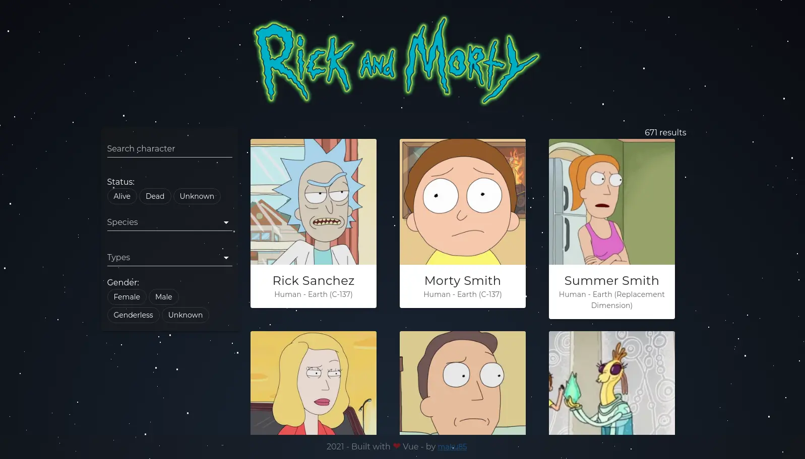

# Rick And Morty Vue app

A simple Vue.js app that lists all characters from the television show "Rick and Morty" based on <a href="https://rickandmortyapi.com"><strong>The Rick and Morty API</strong></a>. Built with vue-cli, Vuetify for the styling and axios to make the API requests.

<p align="center">
  <br>
  
  <br>
</p>

Project demo is available <a href="http://www.maurocunsolo.com/rick-and-morty-vue-app/">here</a>.

## Project setup

```
npm install
```

### Compiles and hot-reloads for development

```
npm run serve
```

### Compiles and minifies for production

```
npm run build
```

### Lints and fixes files

```
npm run lint
```

### Customize configuration

See [Configuration Reference](https://cli.vuejs.org/config/).
